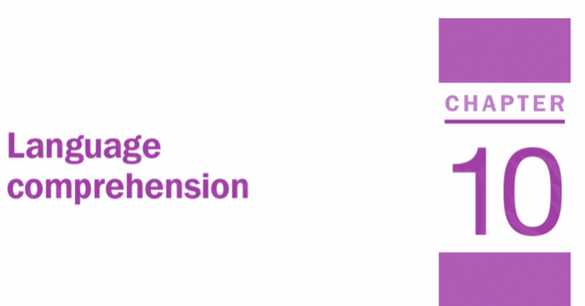
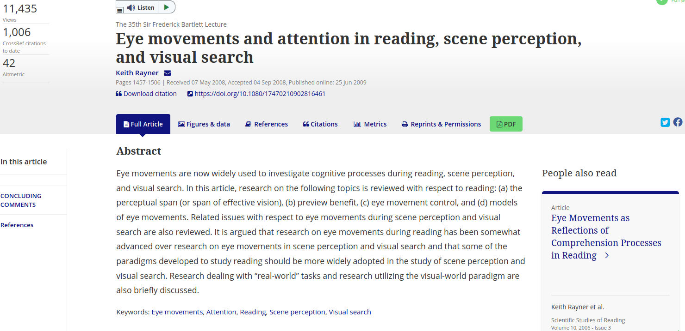

# Overview

Welcome to this first lecture on Language. As with the rest of the lectures in this unit, the material is supported by the Eyesenck and Keane Cognitive Psychology book. The chapter linked to this lecture is Chapter 10 (Language Comprehension). You can access the book by clicking on the image below.

&nbsp;&nbsp;

[{width=50%}](https://ebookcentral.proquest.com/lib/manchester/reader.action?docID=1974350)

&nbsp;&nbsp;

This session is made up of a number of videos and links to various resources that I hope you'll find interesting. You can download the full set of slides that I use in these videos in either .pdf or .odp format by clicking on the appropriate link. The videos are recorded in 1080p resolution, so please do watch them in full screen mode. I've recorded the audio using a podcasting microphone and I recommend you listen with headphones. YouTube generates subtitles automatically and I suggest you turn them on. Most of the time the subtitles are very accurate - but occasionally can go very wrong!

Download the slides for this lecture in [.pdf format.]
Download the slides for this lecture in [.odp format.]

# Part 1 - Introduction

In this first video, you'll hear a little bit about me and my background, information about this lecture, any why Psychologists study language in the first place.

[video1 - intro, I am, and info about this session and the next]

# Part 2 - Ambiguity

In this next video, I will introduce you to some of the different types of ambiguity that are pervasive in language.

[video2 - ambiguity in language]

## The Two Ronnies

After viewing the previous video, have a look at this classic comedy sketch from the BBC comedy series The Two Ronnies (ask your parents) where they demonstrate some of the ways in which ambiguity can arise in speech comprehension.

&nbsp;&nbsp;

<iframe width="560" height="315" src="https://www.youtube.com/embed/gi_6SaqVQSw" frameborder="0" allow="accelerometer; autoplay; encrypted-media; gyroscope; picture-in-picture" allowfullscreen></iframe>

&nbsp;&nbsp;

# Part 3 - Methods

In this part, we'll take a look at some of the techniques used to investigate human language processing. We'll focus first on eye-tracking (tracking people's eyes as they read or listen to spoken language) and what eye-movements can tell us about language processing.

[video3 - methods - eye tracking]

&nbsp;&nbsp;

## Keith Rayner

In the next video, you'll see Keith Rayner give an overview of the processes by which the eyes move during reading. Keith was one of most influential researchers in cognitive psychology who spent decades researching eye-movements and reading. 

&nbsp;&nbsp;

<iframe width="560" height="315" src="https://www.youtube.com/embed/zQmf5TkJrJ8" frameborder="0" allow="accelerometer; autoplay; encrypted-media; gyroscope; picture-in-picture" allowfullscreen></iframe>

&nbsp;&nbsp;

If you're interested in reading more about Keith's work, you might like to read this very comprehensive review article from 2009 where Keith summarises several decades worth of eye-movement reesarch in reading (as well as in scene perception and visual search). Just click on the image below to access the article - note, you'll probably have to log in with your Manchester credentials to access the full version.

&nbsp;&nbsp;

[{width=75%}](https://www.tandfonline.com/doi/full/10.1080/17470210902816461?instName=University+of+Manchester)

&nbsp;&nbsp;

## Protocol for an Eye-Tracking Study

In the next video, you'll learn about how to set up and run an eye-tracking study.

&nbsp;&nbsp;

<iframe allowTransparency="true" allow="encrypted-media *" allowfullscreen height="415" width="460" border="0" scrolling="no" frameborder="0" marginwheight="0" marginwidth="0" src="https://www.jove.com/embed/player?id=50780&t=1&s=1&fpv=1" >
<a title="Using Eye Movements to Evaluate the Cognitive Processes Involved in Text Comprehension" href="https://www.jove.com/v/50780/using-eye-movements-to-evaluate-cognitive-processes-involved-text">Using Eye Movements to Evaluate the Cognitive Processes Involved in Text Comprehension</a>
</iframe>

&nbsp;&nbsp;

# Part 4 - EEG

The measurement of brain activity via changes in electrical activity across the scalp can tell us much about the moment-by-moment processes associated with written and spoken language comprehension.

[video 4]

## An Overview of EEG

The next video provides an overview of Electroencephalography (EEG). We use this (and related) techniques extensively in language processing research.

&nbsp;&nbsp;

<iframe width="560" height="315" src="https://www.youtube.com/embed/tZcKT4l_JZk" frameborder="0" allow="accelerometer; autoplay; encrypted-media; gyroscope; picture-in-picture" allowfullscreen></iframe>

&nbsp;&nbsp;

# Part 5 - Parsing

Parsing is the means by which we understand the structural relationships between different words in a sentence. Different types of information can be used to inform this process, and many decades of research in experimental psychology set out to examine how and when their influence on parsing occurs.

[video5 - parsing]

# Part 6 - Discourse Processing

Discourse processing is the means by which we connect together different pieces of text (e.g., sentence) that we are reading. During reading, we very quickly forget the literal form of the text we have read - what we remember is the 'gist' or the broad meaning associated with the text. A landmark study by [Bransford, Barclay, and Franks (1972)](https://www.sciencedirect.com/science/article/abs/pii/0010028572900035) provided strong evidence to support this view.

[video6 - discourse processing]

# Part 7 - Inferences

One of the challenges when reading a sequence of sentneces is being able to mentally connect their meanings to form a coherent narrative. Very often, we need to make inferences that go above and beyond the information explicitly given in a text to do this.

[video7 - inferences]

# Part 8 - The Event-Indexing Model

[The Event-Indexing Model](https://www.jstor.org/stable/40063035?seq=1) provides a useful theoretical framework to help us understand how readers keep track of different elements in a text. In addition to its initial application to understanding how readers mentally represent text, it has also been applied to how viewers remember and represent the structure of [movies](http://citeseerx.ist.psu.edu/viewdoc/download?doi=10.1.1.69.6574&rep=rep1&type=pdf).

[video8 - event indexing model]

# Part 9 - Anaphors

The same person can be referred to using in many different ways - for example, 'he', 'Andrew', 'Dr Stewart', 'the lecturer with the funny accent' can all be used to refer to me. These are example of *anaphors* and they largely inherit their meaning from the entity to which they refer. 

[video9]

Have a look at this great Mitchell and Webb clip where they show just how tricky it is to know what's going on when the normal rules of how anaphors should be used are ignored.

&nbsp;&nbsp;

<iframe width="560" height="315" src="https://www.youtube.com/embed/tPGc9lYFyZ0" frameborder="0" allow="accelerometer; autoplay; encrypted-media; gyroscope; picture-in-picture" allowfullscreen></iframe>

&nbsp;&nbsp;

# Part 10 - Quantifiers, Depth of Processing, and Summary

In this final part, we'll have a look at some other interesting phenomena in the context of language processing before wrapping up with a bit of a summary.

[video10 - quantifiers, depth of processing and summary]

## Technical Details

All of the material in this lecture was created using open source where possible using an [Entroware Apollo laptop](https://www.entroware.com/store/) running [GNU/Linux distro Ubuntu 20.04 LTS (Focal Fossa)](https://releases.ubuntu.com/20.04/). The audio was captured with a [Fifine USB Podcasting microphone](https://www.amazon.co.uk/Condenser-Microphone-Recording-Interface-Power-K669/dp/B01N034RTC/ref=sr_1_1_sspa?crid=141Z8ED4VGCVD&dchild=1&keywords=fifine+usb+podcast+condenser+microphone&qid=1594989611&sprefix=fifne+usb%2Caps%2C162&sr=8-1-spons&psc=1&spLa=ZW5jcnlwdGVkUXVhbGlmaWVyPUFFMzAxOE5DUDJIREwmZW5jcnlwdGVkSWQ9QTA4MzA2NjIxVU40MlhNMFNCTDhWJmVuY3J5cHRlZEFkSWQ9QTA5NDI2OTQxOFY0R002UVJBS1AzJndpZGdldE5hbWU9c3BfYXRmJmFjdGlvbj1jbGlja1JlZGlyZWN0JmRvTm90TG9nQ2xpY2s9dHJ1ZQ==) and the video with a [Razer Kiyo webcam](https://www.amazon.co.uk/Razer-Streaming-Adjustable-Brightness-Microphone/dp/B076QK6489/ref=sr_1_3?dchild=1&keywords=razer+kiyo&qid=1594989677&sr=8-3). The audio and video were recorded using [Open Broadcast Software](https://obsproject.com/) and edited using [Shotcut](https://shotcut.org/). If you interested in learning more about open source software, you might be interested in having a look at [this set of resources](https://ajstewartlang.github.io/24_open_source/knitted_workshop/24_open_source.html) I have put together.